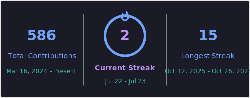

# hello there
### i'm Joe
- 🎓 I'm a cadet at **42 Kuala Lumpur (42KL)**
- 🔭 I’m currently working on the **42 Core Program**
- 🏫 Studying Computer Science in Sunway University
<br>
<div align="center">
<a href="https://git.io/streak-stats"></a>
</div>
<br>
<!--START_SECTION:waka-->

```txt
Unknown        68 hrs 26 mins        ██████████████▒░░░░░░░░░░   57.20 %
C++            15 hrs 47 mins        ███▒░░░░░░░░░░░░░░░░░░░░░   13.20 %
Html           9 hrs 44 mins         ██░░░░░░░░░░░░░░░░░░░░░░░   08.14 %
Python         8 hrs 49 mins         ██░░░░░░░░░░░░░░░░░░░░░░░   07.38 %
CSS            5 hrs 37 mins         █▒░░░░░░░░░░░░░░░░░░░░░░░   04.70 %
```

<!--END_SECTION:waka-->
<br>

           

---
[](https://visitcount.itsvg.in)


